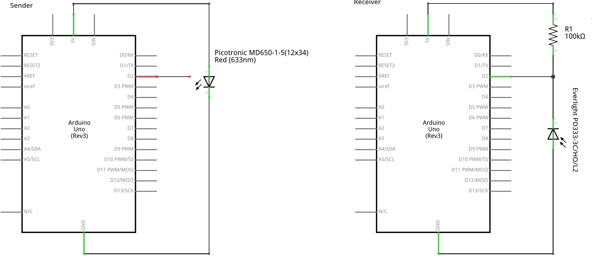
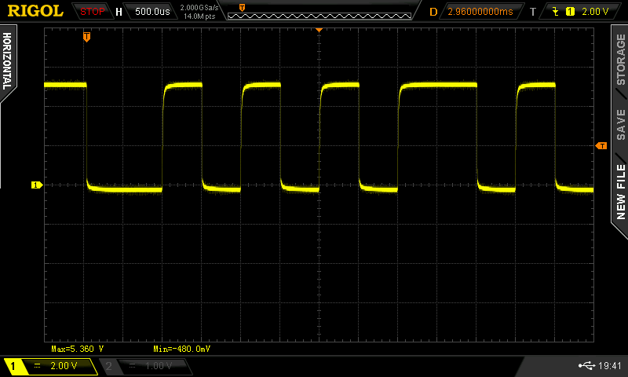
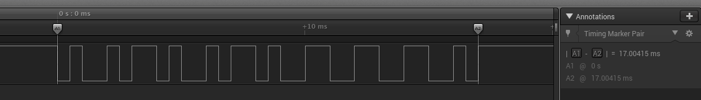

# LightRay: Version 1

## Schematics

The laser used is the Picotronic MD650-1-5(12x34), a laser module with a wavelength of 650nm and an optical power of 1mW (Laser class I). The laser beam focus is adjustable. It is powered with 5V and 22mA and has a separate modulation input with a frequency of up to 100kHz. Further details can be found on the manufacturer's website [here](https://www.picotronic.de/picopage/en/product/detail/id/2566). It can be ordered from Conrad under order number [1283358-62](https://www.conrad.ch/de/lasermodul-punkt-rot-1-mw-picotronic-md650-1-512x34-1283358.html).

The light sensitive element is a photo diode Everlight PD333-3C/H0/L2. It is fast and the range of spectral bandwidth is from 400nm to 1100nm. Further details can be found on the manufacturer's website [here](http://www.everlight.com/file/ProductFile/PD333-3C-H0-L2.pdf). It can be ordered from Conrad under order number [156409-62](https://www.conrad.ch/de/fotodiode-5-mm-1200-nm-everlight-opto-pd333-3chol2-156409.html).

The schematics is straight forward. Using an Arduino Uno the laser module can be directly fixed attached to the Arduino. On the receiver side the photo diode is used in reverse direction with a pullup resistor.



The electrical signal on the receiver side is pretty strong. The pulse width used was 500µs and sender and receiver were just some centimeters apart.




## Data flow

A single data byte is split into two nibbles and each is encoded using [Hamming(7,4) encoding](https://en.wikipedia.org/wiki/Hamming(7,4)) with an additional parity bit. So in each nibble a single bit error can be corrected and up to two bit erros can be detected. This gives 16 bits of data. This is now [Manchester encoded](https://en.wikipedia.org/wiki/Manchester_code) to create a self-clocking signal. To ensure proper detection of start and end of a message we add a start and stop bit (each encode in 2 bits). In total we get 36 bitsof data to transmit. On the receiver side the encodings are decoded in reverse order.


## Example

Let's send the byte 01011001. The byte is split into its two nibbles and each is Hamming(7,4) encoded:
```
0101 -> 01010101
1001 -> 10011001
```
The lower 4 bits contain the data itself, the upper four bits contain the parity bits with the MSB the additional parity. The results are concatenated giving 16 bits of data, written here sets of four
```
0101 0101 1001 1001
```
Those bytes are now Manchester encoded. We use the convention from IEEE 802.4: A '0' is encoded as a falling edge, a '1' as a raising edge. Since we are going to send the data starting with the LSB and ending with the MSB, a '0' is encoded as "01" and a '1' as "10". The starting bit is '1' (encoded as "10") and the stop bit is '0' (encoded as "01").
```
01 01100110 01100110 10010110 10010110 10
```
Because the modulation input of the laser is low-active, we have to invert this information. If this data is send, it looks like this

 


## Speed

A single byte of data is encoded in 36 bits. With an example pulse width of 500µs, this means in a second we can transfer 55.56 bytes, the speed is 444 bauds. That is not too impressive, but Version 1 is supposed to be a proof-of-concept, no more.
