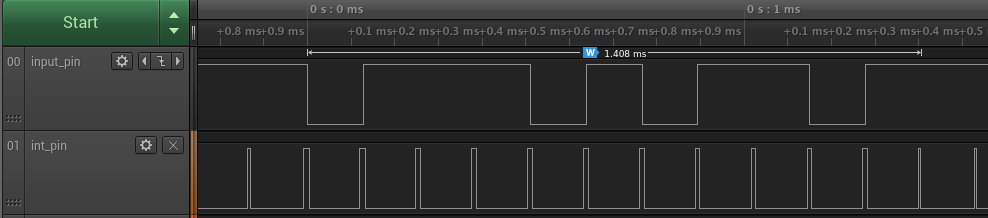
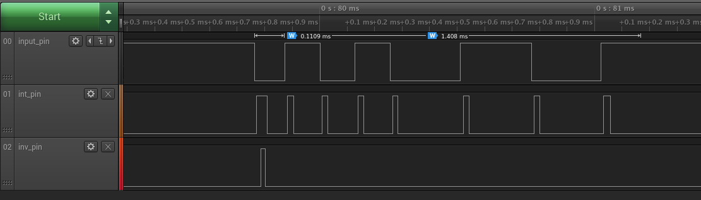
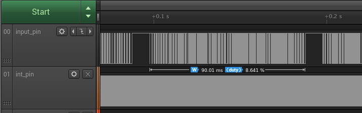
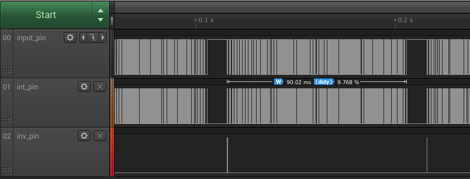
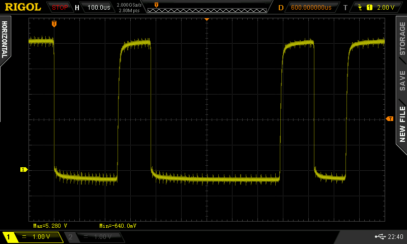

# LightRay: Version 2

## Schematics

The hardware used and the schematics are exactly the same as in [Version 1](../Version1/README.md).

## Data flow

In this Version we do not use forward error correction (FEC) like Hamming encoding nor do we use Manchester encoding. We use a very compact [non-return-to-zero (NRZ)](https://en.wikipedia.org/wiki/Non-return-to-zero) encoding that encodes a single bit of data into a single bit on the line. We use one start and two stop bits.


The plan is to later add FEC on a higher protocol level.

## Example

Let's send the byte 00010100. We are adding one start and two stop bits to the data:

```
00010100 -> 1 00010100 10
```

This time we send the MSB first and the LSB last. Again the laser is low-active. The pulse width is 128µs, sending 11 bits takes 1.408ms. The top diagram shows the sending of the bits shown before.



The lower diagram shows the duration, the microcontroller spends in the timer interrupt routine of the sender. This is measured by temporarily adding writes to a digital output pin ```int_pin``` to the interrupt routine:

```C
void callback()
{
  digitalWrite(int_pin, HIGH); // <----- here ...
  if (xfer_num_bits > 0) {
    digitalWrite(output_pin, GET_BIT(xfer_data, xfer_num_bits - 1) == invert_output ? LOW : HIGH);
    xfer_num_bits--;
  }
  digitalWrite(int_pin, LOW); // <----- ... and here
}
```

Of course it is just an estimate, the measurement includes time for executing our code instrumentations. It is visible that the interrupt routine actually takes longer to process, if there is actual data to send.

Let's take a look how things look at the receiver. In the top diagram is the receiving of the byte 01011001:

```
1 01011001 10 -> 01011001
```



The middle diagram shows the time the receiver spends in the interrupt routine, which is edge-triggered on the input_pin. And the lower diagram signals whenever the duration between the last and current edge is not a multiple of the pulse width or the factor is larger than 10: In these cases ```valid == false``` and the receiver resets its state and buffer:

```C
bool valid = ((rounded & valid_pattern) == 0) && (num_cycles <= 10);

if (!valid) {
  xfer_data[active] = 0;
  xfer_num_bits[active] = 1;
  return;
}
```

## Performance

In this version we used a very compact line encoding and we have been able to use a lower pulse width of 128µs. To transfer a single byte, we have to transfer 11 bits which is possible in 1.408ms. This gives a speed of 710 bytes/s or 5682 bauds For the first time burst sending has been tested: The sender sends 64 bytes as fast as possible before making a small pause. 64bytes times 1.408ms/byte gives 90.112ms.

The sender takes about this time to send a burst (1 * pulse width has to be added to the 90.01ms). And we see that during this burst the senders spends about 8.6% of the time in the interrupt routine:



The receiver spends 9.8% in the interrupt routine. And we can see that at the beginning of every burst the receiver resets its buffers:



The signal on the receiver side looks still okay at a pulse width of 128µs:



All tests have been made with the laser being just a couple of centimeters away from the photo diode.
