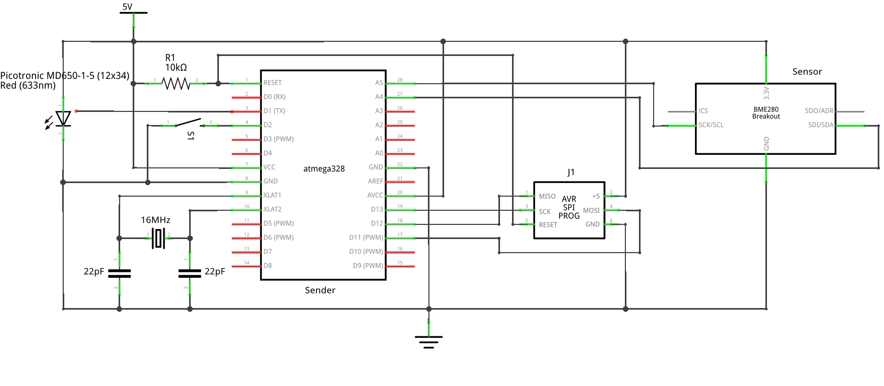
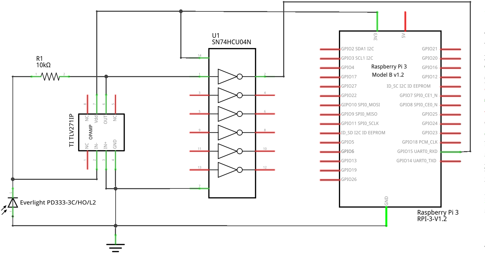
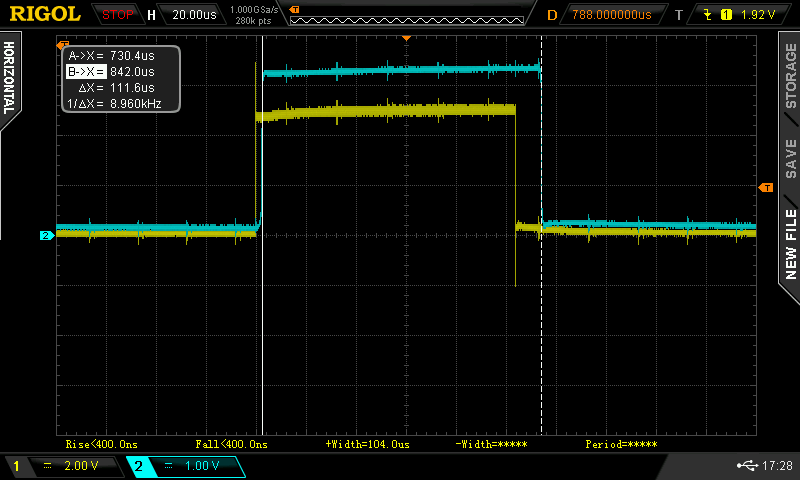

# LightRay: Version 3

In [Version 1](../Version1/README.md) and [Version 2](../Version2/README.md) we focussed on controlling the sending and receiving of every single bit in software. This gives you all the freedom to handle things, but puts some heavy load on the CPU and you need some real-time capabilities in the system. This is why we used microcontrollers without any operating system so far. The basic idea for this version now is to use the UART of an Arduino and an Raspberry Pi to do the heavy lifting.

## Schematic

### Sender

The sender schematic is derived from a minimal schematic for an ATmega328P 8-bit microcontroller, the heart of the *Arduino Uno*. It is powered with 5V because that is the specified input for the laser.



The laser module is the same as in Version 1, just that the modulation input is connection with the TX pin of the serial output of the microcontroller. The TX pin is high when in idle mode and - that is very convenient - the laser is low active, too, so it is turned off when idle.

There is a 6-pin AVR ISP programming port to program the microcontroller, e.g. with an [USBtinyISP](https://learn.adafruit.com/usbtinyisp/overview).

To have something useful to send, we integrated a [Bosch BME280](https://www.adafruit.com/product/2652) sensor for temperature, pressure and humidity measurements.

The switch S1 is used to switch the sender into a *test mode*: In *normal mode* the sender would send an update maybe every 5 minutes. In *test mode* there is continuous sending of test data which makes the alignment of laser and photo diode easier and the test data allows for transmission quality testing on the receiver side. Once the setup/testing is done, the system can be switched back to *normal mode*.

### Receiver

This is the receiver schematic. We use a Raspberry Pi, since we do not need real-time capabilities on the receiver side anymore and we want to store measurement data that has been received from the sender.



The underlying concept of this schematic is the so-called [transimpedance amplifier](https://en.wikipedia.org/wiki/Transimpedance_amplifier) using an operational amplifier to convert the small current of the photo diode into a voltage. We picked a [Texas Instruments TLV271](http://www.ti.com/lit/ds/symlink/tlv274.pdf) as opamp and an [Everlight PD333](http://www.everlight.com/file/ProductFile/PD333-3C-H0-L2.pdf) as the photo diode.

The whole system is powered by the 3.3V of the Raspberry Pi 3 and the output of the opamp is fed into the RX pin of the Raspberry Pi.

Unfortunately, the output of the opamp is just the inverse of what we need: Sender TX high, laser off, photo current low, voltage output of opamp low, Receiver RX low. So we use a standard Hex-Inverter chip [SN74HCU04N](http://www.ti.com/lit/ds/symlink/sn74hcu04.pdf) to logically invert the signal.

## Software

Lets say we measure a temperature of 22.4°C, a pressure of 968.2 mbar and a humidity of 41%, we convert the values in integers and put them into a CSV string:

```
224;9682;41
```

Before transfering the string, the data is extended with Forward Error Correction data using Reed Solomon Codes and the library [Arduino-FEC](https://github.com/simonyipeter/Arduino-FEC). The library allowed fixed sizes of user data and error correction data, we picked 16 bytes of user data and 16 bytes of error correction data. This makes 32 bytes of message data. So we can correct up to 8 bytes (25%) of faulty data.

To allow a client to detect the start and length of a frame, the data send looks like this:

* 1st byte: Start byte (0xfc)
* 2nd byte: Length of escaped message data in bytes
* Message data, escaped between 32 and 64 bytes

To avoid start bytes (or escape bytes) in the message data, those have to be escaped. So the message size depends on the number of bytes that have to be escaped. E.g. sending 32 bytes of 0x00, nothing has to be escaped, the message data are 32 bytes. E.g. sending 32 bytes of 0xfc, all bytes have to be escaped, the message data are 64 bytes.

### Sender

To compile the server software, there are two libraries that have to be installed, because of the sensor we picked:

* [Adafruit Unified Sensor](https://github.com/adafruit/Adafruit_Sensor) (tested with 1.0.2)
* [Adafruit BME280 Library](https://github.com/adafruit/Adafruit_BME280_Library) (tested with 1.0.7)

To upload the sofware with an *USBtinyISP*, choose "Sketch -> Upload Using Programmer" in the Arduino IDE.

Remark: The sender can easily be turned into a low-power weather station with laser data transmission. During the sleep-periods of microcontroller has to be put into deep sleep to save as much energy as possible.

### Receiver

#### Setup serial port of Raspberry Pi

The Raspberry Pi has two serial ports, but only one (PL011) is more stable and flexible. To configure this for the GPIO, some steps have to be taken, that are fully described in ["Raspberry Pi UARTS"](https://www.raspberrypi.org/documentation/configuration/uart.md).

Here is in short what you have to do:

* Disable Linux usage of under **Interfacing options** and **Serial**

  ```bash
  sudo raspi-config
  ```

* Add line to /boot/config.txt to restore ```/dev/ttyAMA0``` to GPIOs 14 (TX, pin 8) and 15 (RX, pin 10)

  ```bash
  dtoverlay=pi3-disable-bt
  ```

* Stop Bluetooth services

  ```bash
  sudo systemctl disable hciuart
  ```

#### Setting up the software of Raspberry Pi

We assume you have a Raspian installed on your Raspberry Pi. We tested with a Raspberry Pi 3 but it may work with other versions of it as well.

The receiver software was written in Python (using Python 3) and since we need a Python binding for the *Arduino-FEC*, some packages have to be installed:

```bash
sudo apt-get install python3 python3-dev
```

Then execute a make command in the receiver directory

```bash
make all
```

#### Running the receiver

```bash
python3 receiver.py
```

The receiver just outputs the data that has been receiver or appropriate error messages:

```
(22.3, 967.9, 39.0)
```

## Performance

The maximum baud rate that has been used successfully in the setup described above was 4800 bauds which is much lower than was expected.

For an investigation on why that was the case we hooked the TX output of the sender (channel 1, yellow) and the RX input of the receiver (channel 2, cyan) to a scope. The baud rate was 9600 bauds which had a high transmission failure rate.

The sender signal (yellow) shows the transmision of a single bit. The signal width (delta X) is pretty much 1/9600=104.167µs. Perfekt.


The receiver signal (cyan) is a little delayed by 2.8µs against the sender signal, which is expected, because of the delay if the signal through laser and receiver circuit. But the signal width (delta X) is 111.6µs.



This is a problem for the receiver. The allowed pulse width at 9600 bauds is between 98µs and 110µs. See here an extended evaluation of timing problems on serial lines: ["Serial Baud Rates, Bit Timing and Error Tolerance"](http://www.picaxe.com/docs/baudratetolerance.pdf). Cause for this behavior could be differnt raise and fall times for the signal in the circuit. To further investigate, the signal has to be checked at intermediate points in the circuit to identify the component(s) that cause the problem.
